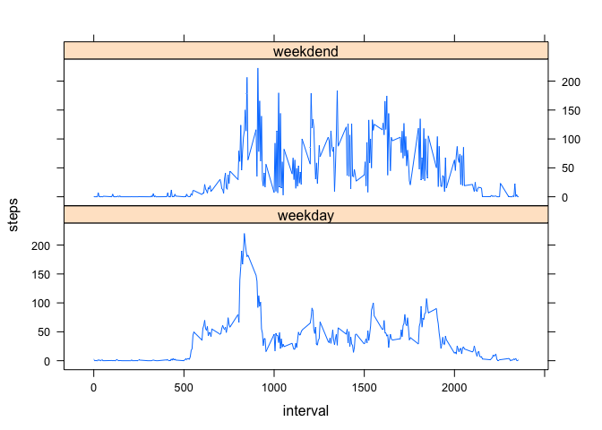

# Reproducible Research: Peer Assessment 1


## Loading and preprocessing the data

1. Load the data 


```r
data <- read.csv('activity.csv', colClasses=c(NA, "Date", NA))
```


## What is mean total number of steps taken per day?

```r
total <- aggregate(data$steps, list(date = data$date), FUN = sum)
total <- total[!is.na(total$x), ]   ## remove NA's
```

1. Make a histogram of total number of steps taken per day


```r
hist(total$x, xlab="Total number of steps", 
     main="Total number of steps taken each day")
```

 

2. Calculate and report the mean and median total number of steps taken per day


```r
mean_total <- mean(total$x)
median_total <- median(total$x)

mean_total; median_total
```

```
## [1] 10766
```

```
## [1] 10765
```

## What is the average daily activity pattern?


```r
data2 <- data[!is.na(data$steps), ]   # remove NA's
avg <- aggregate(data2$steps, list(interval=data2$interval), FUN=mean)
```

1. Make a time series plot (i.e. type = "l") of the 5-minute interval (x-axis) and the average number of steps taken, averaged across all days (y-axis)


```r
with(avg, plot(interval, x, type="l", 
               ylab="average number of steps taken, averaged across all days"))
```

 

2. Which 5-minute interval, on average across all the days in the dataset, contains the maximum number of steps?


```r
max_interval <- avg[avg$x %in% max(avg$x), ]
max_interval
```

```
##     interval     x
## 104      835 206.2
```

answer: 104th interval has the maximum number of steps (averged accross all the days)

## Imputing missing values

1. Calculate and report the total number of missing values in the dataset (i.e. the total number of rows with NAs)


```r
sum(is.na(data$steps))
```

```
## [1] 2304
```

2. Devise a strategy for filling in all of the missing values in the dataset. The strategy does not need to be sophisticated. 
For example, you could use the mean/median for that day, or the mean for that 5-minute interval, etc.

-> Simply, I chose to fill missing values with the mean for that 5-minute interval.

3. Create a new dataset that is equal to the original dataset but with the missing data filled in.


```r
data3 <- data
missing <- which(is.na(data3$steps))   ## indices of NA steps values
mean_by_interval <- rep(avg$x, nrow(data3)/nrow(avg))
data3$steps[missing] <- mean_by_interval[missing]   ## replace NA's
```

4. Make a histogram of the total number of steps taken each day  and Calculate and report the mean and median total number of steps taken per day. 

Do these values differ from the estimates  from the first part of the assignment? What is the impact of imputing missing data on the estimates of the total daily number of steps?


```r
total2 <- aggregate(data3$steps, list(date = data3$date), FUN = sum)
```

Here is the histogram 


```r
hist(total2$x, xlab="Total number of steps (NA's replaced)", 
     main="Total number of steps taken each day")
```

 

Here is the mean and median values


```r
mean_total2 <- mean(total2$x)
median_total2 <- median(total2$x)

mean_total2; median_total2
```

```
## [1] 10766
```

```
## [1] 10766
```

There is NO significant difference between NA-replaced values and other values, because NA values are replaced with the mean values.

## Are there differences in activity patterns between weekdays and weekends?

1. Create a new factor variable in the dataset with two levels – 
“weekday” and “weekend” indicating whether a given date is 
a weekday or weekend day.


```r
data4 <- data3
data4$date <- weekdays(as.Date(data4$date, format = "%Y-%m-%d"))
data4$weekend <- ifelse(data4$date == c("토요일", "일요일"), 
                        c("weekdend"), c("weekday"))
data4$weekend <- factor(data4$weekend)
```

2. Make a panel plot containing a time series plot (i.e. type = "l") 
of the 5-minute interval (x-axis) and the average number of steps 
taken, averaged across all weekday days or weekend days (y-axis). 
The plot should look something like the following, which was 
creating using simulated data:


```r
avg2 <- aggregate(steps ~ interval + weekend, data = data4, mean)

library(lattice)
xyplot(steps ~ interval | weekend, avg2, type="l", layout = c(1, 2))
```

 


